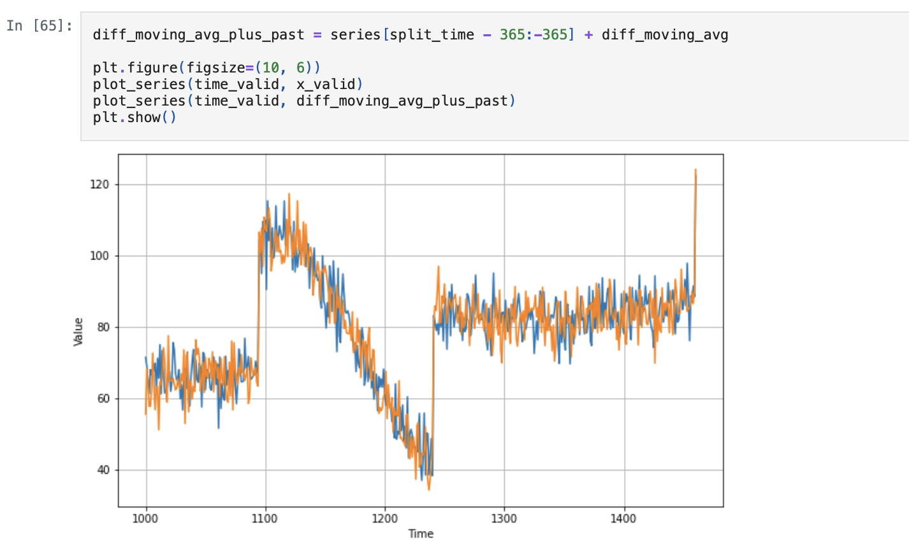
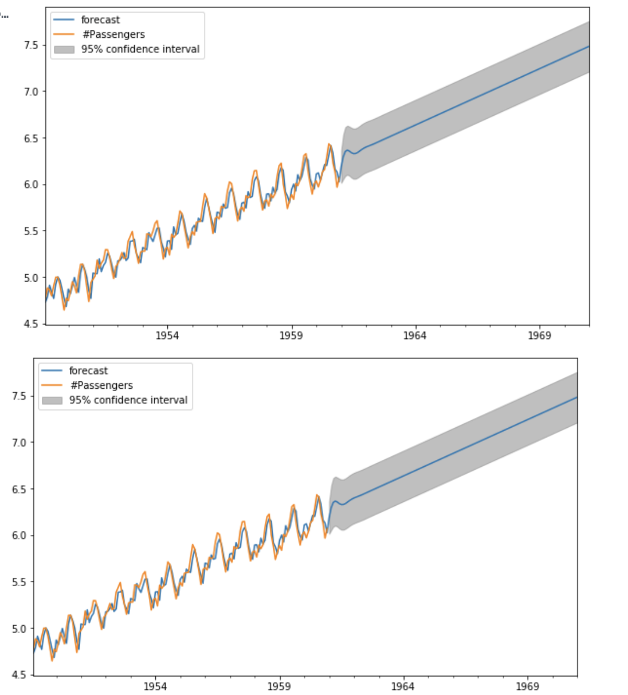
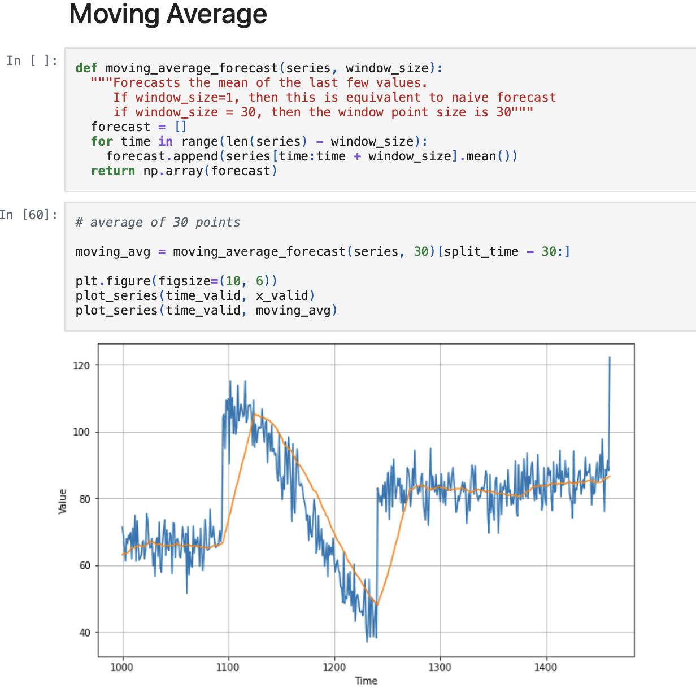
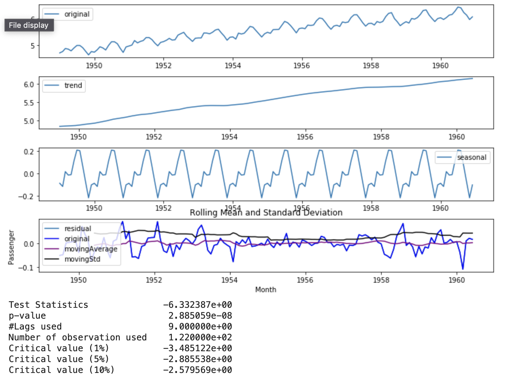
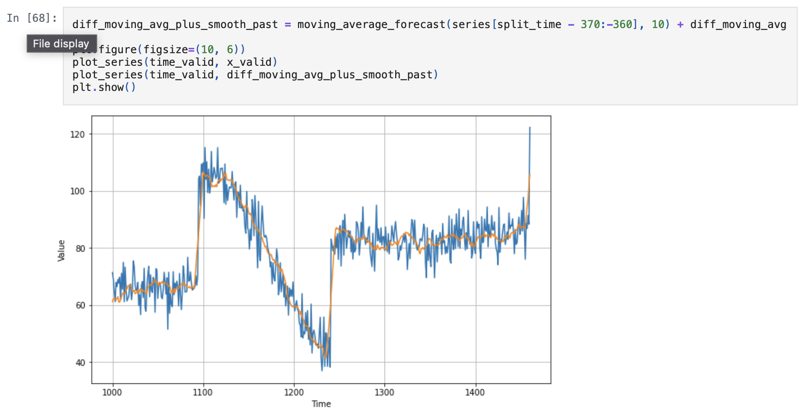
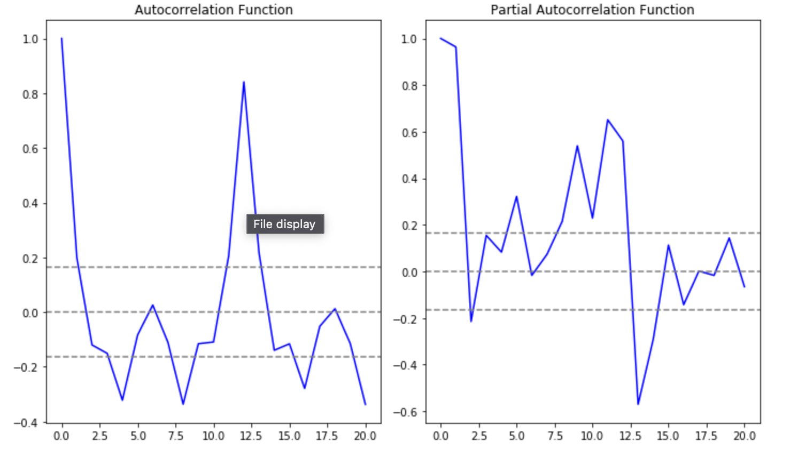
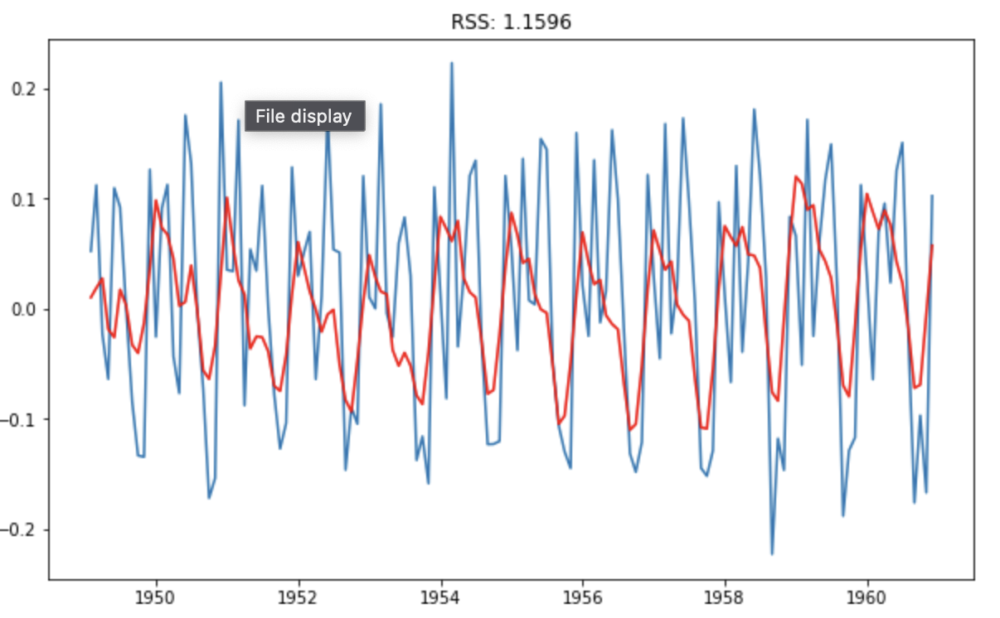
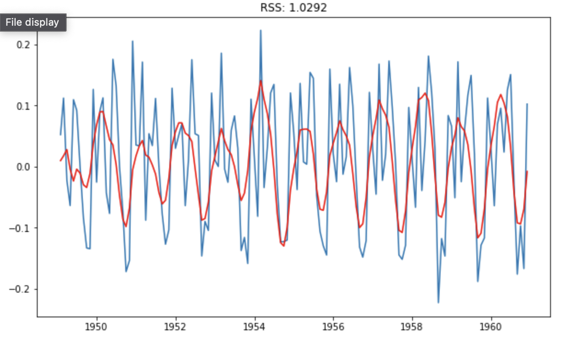
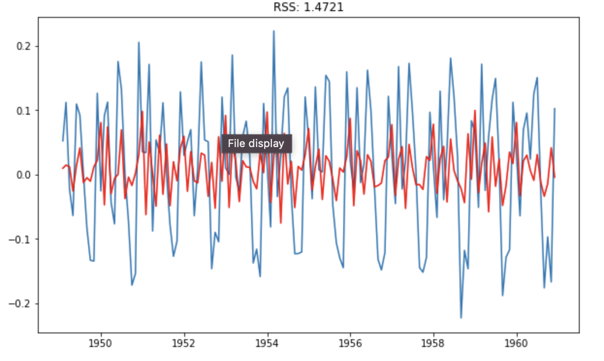

# Time Series Forecasting in Python

This repository contains the code and resources for the book "Time Series Forecasting in Python". The goal of this book and its accompanying code is to teach you how to build powerful and accurate predictive models for time series data using the Python programming language.

## About the Project

"Time Series Forecasting in Python & TensorFlow" provides a comprehensive guide to understanding, building, and deploying time series forecasting models. From traditional statistical methods to advanced deep learning techniques, this resource covers everything you need to become proficient in time series prediction. Each chapter is accompanied by hands-on projects using real-life datasets, ensuring a practical learning experience.

## Key Topics & Features

* **Understanding Time Series Data:** Learn to identify and analyze the characteristics of time series.
* **Statistical Forecasting Models:** Explore traditional methods for time series prediction.
* **Deep Learning for Time Series:** Dive into advanced deep learning architectures like LSTMs and CNNs using TensorFlow/Keras for more complex forecasting tasks.
* **Multivariate Forecasting:** Build models that can predict multiple time series simultaneously.
* **External Variables & Seasonality:** Incorporate additional data and seasonal patterns into your forecasts.
* **Automated Forecasting:** Discover tools like Prophet for streamlined forecasting.
* **Real-world Datasets:** Hands-on projects using diverse datasets, including financial data, economic indicators, and energy consumption.

## Visualizations

Below are some illustrative plots from the projects within this repository, showcasing various aspects of time series analysis and forecasting. These images are located in the `PredictingSequence-TimeSeriesAnalysis/Time Series Prediction In Tensorflow/Images` directory.

* **Initial Time Series Plot:**
    

* **Trend Identification:**
    

* **Seasonality Component:**
    

* **Model Fit Visualization:**
    

* **Prediction vs. Actual:**
    

* **Error Analysis:**
    

* **Deep Learning Model Architecture:**
    

* **Loss Curve during Training:**
    

* **LSTM Model Output:**
    

* **Forecasting Future Values:**
    

## Getting Started

To get started with the code, follow these steps:

1.  **Clone the repository:**
    ```bash
    git clone [https://github.com/rakibhhridoy/PredictingSequence-TimeSeriesAnalysis.git](https://github.com/rakibhhridoy/PredictingSequence-TimeSeriesAnalysis.git)
    ```
2.  **Navigate to a chapter directory:**
    ```bash
    cd PredictingSequence-TimeSeriesAnalysis
    ```
3.  **Install the necessary libraries:**
    (It's recommended to use a virtual environment)
    ```bash
    pip install -r requirements.txt # (assuming a requirements.txt exists in each chapter or root)
    ```
    *If a `requirements.txt` is not provided, you might need to install libraries like `pandas`, `numpy`, `matplotlib`, `seaborn`, `tensorflow`, `keras`, `scikit-learn`, `pmdarima`, `statsmodels`, `prophet` manually.*
4.  **Open and run the Jupyter notebooks:**
    ```bash
    jupyter notebook
    ```

## Contributing

We welcome contributions to improve this repository! If you have suggestions, bug reports, or would like to add new examples or improve existing ones, please feel a free to open an issue or submit a pull request.

## License

This project is licensed under the Apache-2.0 License - see the [LICENSE](LICENSE) file for details.

## Contact

If you have any questions or feedback, please feel free to reach out.

---